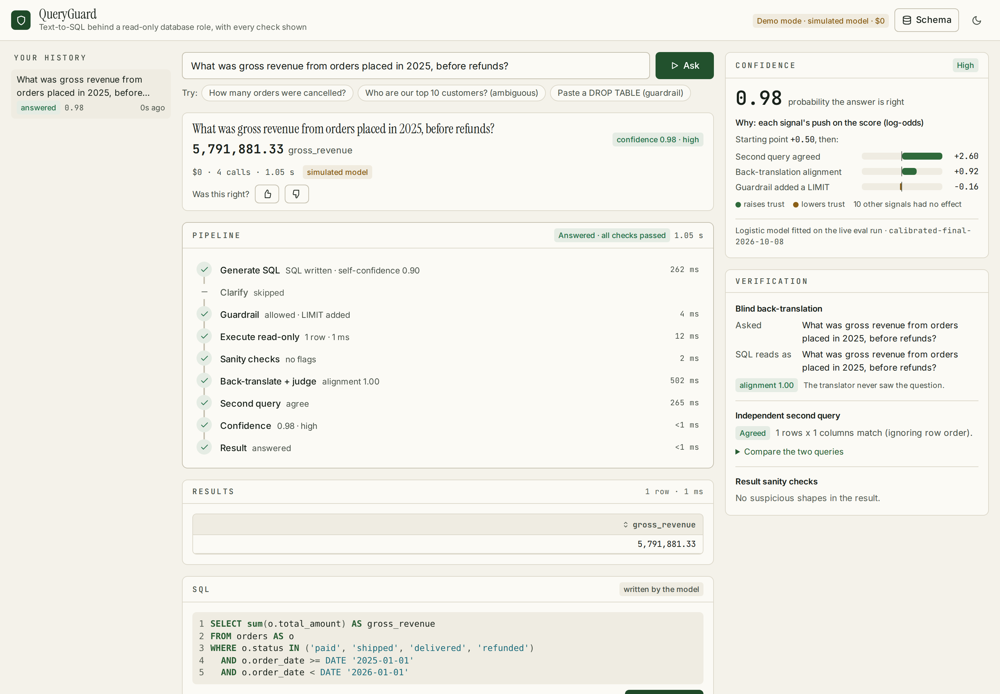
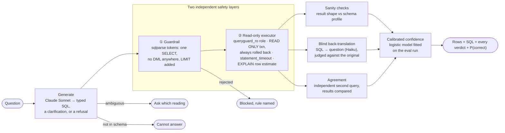

# QueryGuard

[](https://github.com/Zemukiros/queryguard/actions/workflows/ci.yml)


[](LICENSE)

**Text-to-SQL that tells you when not to trust the answer.** An LLM writes the SQL, a database role that
can't write runs it, and three independent checks feed a calibrated probability that the answer is right.
On the eval set that probability flags 99% of known-wrong queries.

**Live demo: [queryguard-livid.vercel.app](https://queryguard-livid.vercel.app)**. It runs the real model within a
$0.50 daily spend ceiling. Past that, or with the kill switch off, questions run in demo mode, and the header says
which mode answered.



## Quickstart

```bash
docker compose up        # http://localhost:8080 · demo mode: simulated model, $0, no API key
```

Demo mode answers the eval set's questions from `evals/golden.yaml`. The guardrail, the read-only database and
every check run for real. Try the three example buttons: a normal question, an ambiguous one (pick a reading
and it runs) and a pasted `DROP TABLE` (blocked, with the rule named).

**Real model:** put `ANTHROPIC_API_KEY=...` in `.env` (copy `.env.example`), then `FAKE=0 docker compose up`.
Each question then costs about $0.01–0.03, capped by a daily spend ceiling (`QUERYGUARD_DAILY_SPEND_USD`, default $1).

**Development:**

```bash
cp .env.example .env && docker compose up -d db && uv sync
make dev FAKE=1          # API :8000 + Vite :5173, demo mode;  `make dev` uses the real model
make check               # eslint, tsc, pytest, vitest, Playwright e2e, production build
```

## Results

The numbers come from recorded eval runs at prompt version `p-02ea2fb3b358`:
- 50 golden questions through the full pipeline;
- 104 known-wrong mutation queries and 40 golden queries through the validators.

**These numbers are final for this prompt version.** The eval is frozen; more tuning against the same set
would overfit to it. Full write-up: **[docs/EVAL_RESULTS.md](docs/EVAL_RESULTS.md)**.

| metric | result |
|---|---|
| Execution accuracy (result matches the golden result) | **39/40** answerable · **10/10** ambiguous or unanswerable correctly declined |
| Wrong answers flagged (calibrated confidence < 0.5) | **99.0%** (103/104) |
| False flags on correct answers | **7.6%** (6/79) |
| Brier score, hand-set → calibrated (out-of-fold) | **0.051 → 0.038** |
| ECE (10 bins), hand-set → calibrated | **0.109 → 0.072** |
| Cost per question (real model, median) | **$0.0135**, at most 4 API calls |
| Latency per question (real model) | median **10.2 s**, p90 **14.1 s** |


## How it works



- **Generate** (`generate.py`) sends the question, a compact introspected schema with column comments, a metric
  glossary and few-shot examples. It returns typed SQL, `ClarificationNeeded` with runnable readings, or
  `CannotAnswer`.
- **Guard and execute** (`guardrails.py`, `executor.py`). The executor never raises: every outcome is a typed
  result.
- **Validate** (`validation/`) runs the three checks in the diagram.
- **Score** (`confidence.py`) explains its output signal by signal.
- **Serve** (`api/`, `web/`). FastAPI streams the pipeline as typed stage events over SSE. The React UI shows
  the stages arriving live and runs your own SQL through the same checks.

## Design decisions

- **The database is the boundary, the guardrail is the second one.**
  - Each layer holds without the other: the executor never assumes the guardrail ran.
  - `queryguard_ro` has `SELECT` and nothing else, including on tables created later. `scripts/verify_db.py`
    proves its writes fail.
  - The guardrail works on sqlparse tokens, never raw substrings, and has 81 tests with no database or network.
  - The API keeps its own state in SQLite, so it never needs a writable Postgres identity. In Docker it never
    sees the owner credentials either: a one-shot `introspect` service builds the schema cache.
- **Blind back-translation.**
  - The model that turns SQL back into a question never sees the original question. Shown both, it reads the
    query charitably.
  - A separate judge compares the two questions without the schema.
  - The judge sees the metric glossary only when the question uses a glossary term. Given the glossary on every
    question, it read "total order amount" as revenue.
- **Mutation-based negatives.** The model was wrong on just 1 of 40 answerable questions in the first run, too
  few to calibrate on. `evals/mutations.py` builds 104 known-wrong variants of the golden SQL across 9 error
  types: fan-out join, dropped `WHERE`, column swap, aggregate swap, date shift, literal case, order flip, null
  flip, inner→left join. Every one is verified to change the result.
- **Grouped cross-validation.**
  - Calibration uses `GroupKFold` by golden question, so a question's golden SQL, its mutations and its generated
    answer always land in the same fold.
  - Without grouping, the model would be scored on mutations of SQL it had already seen.
  - Every reported metric is out-of-fold.
- **Dropping self-confidence.** The model's self-reported confidence is an injected constant on every mutation
  and golden row, so it can only work as a "this row was generated" shortcut. It is kept only if it improves
  out-of-fold Brier by more than 0.005. It improved it by 0.00009, so it was dropped.
- **Cost controls everywhere.**
  - Per question: at most 4 API calls.
  - Per process: a request cap.
  - Per client: rate limits.
  - Globally: a daily spend ceiling read from the call ledger, with a per-question reserve. Cache hits are free.
  - In the eval harness: ledger-backed call and cost caps with worst-case reservations, so a run stops cleanly
    before a cap rather than after.
  - Tests can't construct a real SDK client, and demo mode spends $0.

## Known limitations

- **Measured on the set it was fixed on.** The first eval found a real blind spot. refund_04 ("gross revenue
  before refunds") summed unpaid orders, and every check passed it, because all three compare SQL with the
  *question* and none knew the *business rule*.
  - A metric glossary fixed it: in the schema comments, the prompt and, for revenue questions, the judge. A
    `revenue_status` sanity check was added alongside.
  - refund_04 is now correct, and both mutations that had slipped through are caught.
  - That fix was found and measured on the same golden set, so the numbers flatter it. Only a held-out set
    can say how it generalises.
- **No organic errors in the calibration set.** All 104 wrong rows are mutations, which are mechanical errors.
  Real model errors look like refund_04 did: plausible, consistent and silent. Expect the probabilities to be
  overconfident on real traffic.
- **Mixed provenance.** For the 144 mutation and golden rows, the second query was reused from earlier runs.
  129 of them come from before the glossary existed.
- **Comparison relaxations and other gaps.** Two golden comparisons were loosened after results were seen
  (join_06, agg_05). One question (date_05) now asks for clarification where it used to answer.
  [EVAL_RESULTS.md](docs/EVAL_RESULTS.md#known-limitations) has the details.
- **Narrow scope.** One synthetic e-commerce schema: 40 golden SQLs and 50 questions. Confidence intervals are
  wide.

## Stack

Python 3.12 · uv · FastAPI · SQLAlchemy + psycopg 3 · sqlparse · pandas · PostgreSQL 16 · Anthropic SDK
(Claude Sonnet for SQL, Haiku for validation) · scikit-learn (calibration, offline) · Vite + React +
TypeScript (strict) · Tailwind v4 · TanStack Query · CodeMirror 6 · Playwright · Docker · GitHub Actions ·
Vercel (Services) · Neon Postgres · Upstash Redis ([deployment](docs/DEPLOYMENT.md)).

API types in the UI are generated from the FastAPI OpenAPI schema (`make gen-api`), and CI fails if they drift.

## License

[MIT](LICENSE)
