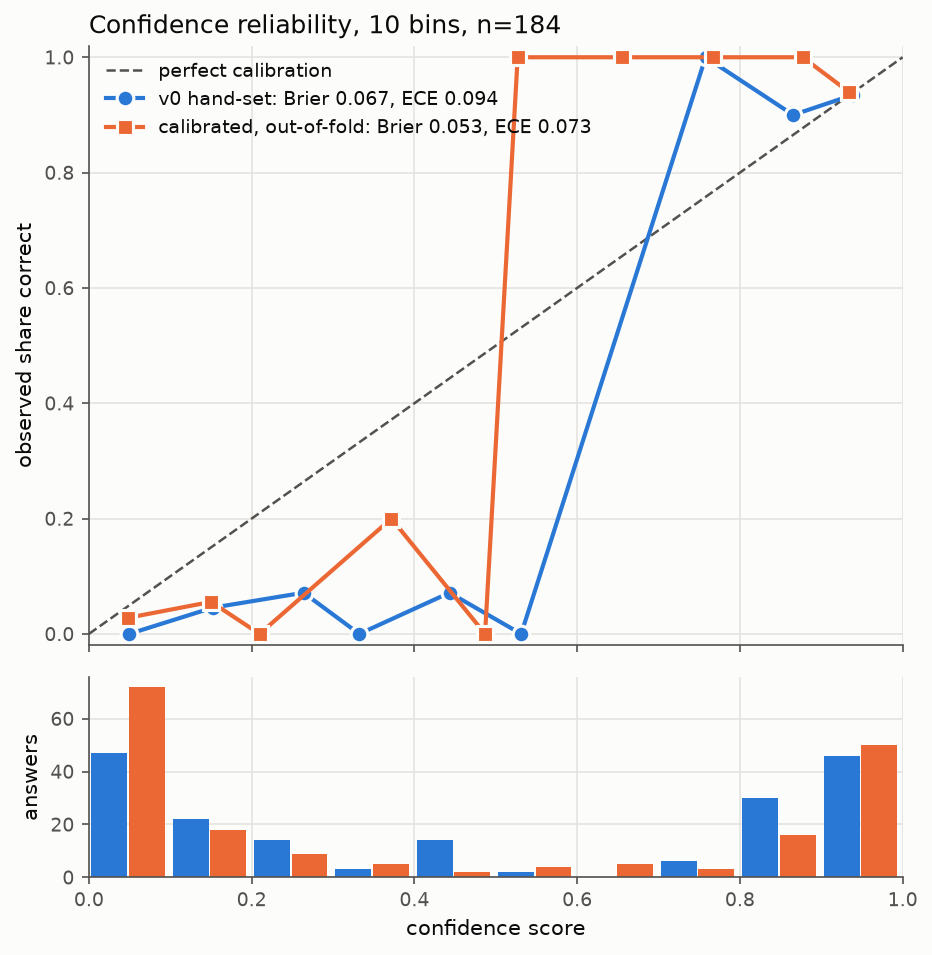

# Eval results: `live-2026-10-01`

Every number here comes from the recorded run in `evals/results/live-2026-10-01.*`.
The calibration was fitted and scored offline from that run. Calibrating made no API calls.

```bash
uv run python -m evals.calibrate --run-id live-2026-10-01   # refit, rescore, redraw: free, no DB, no API
```

Outputs: `src/queryguard/validation/calibration.json` (runtime weights),
`evals/results/live-2026-10-01.calibration.json` (every metric below, plus each row's out-of-fold score) and
`docs/calibration.png`.

## The run

194 items, all from `evals/golden.yaml`:

| population | items | what it is | label |
|---|---|---|---|
| generated | 50 | every golden question through the full pipeline (`run_question`) | result compared with the golden result |
| mutation | 104 | known-wrong SQL from `evals/mutations.py`, through `run_answer` | wrong |
| golden | 40 | the golden SQL itself, through `run_answer` | correct |

Models, from the call ledger: `claude-sonnet-5` (216 calls) writes the SQL, both the first and second query. `claude-haiku-4-5` (370 calls) handles back-translation and the alignment judge.

## 1. Generation accuracy

| category | questions | correct | notes |
|---|---|---|---|
| simple_lookup | 7 | 7 | |
| join | 7 | 7 | join_06 counted correct under a relaxed comparison (see limitations) |
| aggregation | 7 | 7 | agg_05 counted correct under a relaxed comparison (see limitations) |
| date_range | 7 | 7 | |
| top_n | 6 | 6 | |
| refund_trap | 6 | 5 | **refund_04 wrong** (see limitations) |
| ambiguous | 5 | 5 | 5/5 asked for clarification |
| unanswerable | 5 | 5 | 4/5 refused (`CannotAnswer`), 1/5 answered with self-confidence 0.25 |
| **total** | **50** | **49** | answerable: 39/40 · declines: 10/10 |

**Clarification and refusal correctness.** All 5 ambiguous questions came back as `ClarificationNeeded`. None
produced SQL. Of the 5 unanswerable questions, 4 were refused with a correct reason, for example "no warehouse
table or column anywhere". The fifth, unans_01 ("average time between shipping and delivery"; there is no
`delivered_at`), ran a stand-in query (`shipped_at - order_date`) with self-confidence 0.25. The harness counts
self-confidence below 0.5 as a decline. The pipeline itself still returned an answer, but the calibrated score
gives that answer **0.016**, so a caller would see it flagged.

## 2. Calibration method

- **Fitting set: 184 rows** (79 correct, 105 wrong): every row with a feature vector except unans_01.
  Unanswerable and ambiguous items are labelled on whether the pipeline declined, not on whether their SQL was
  right, so their label doesn't mean "this answer is correct". The 9 clarifications and refusals have no feature
  vector. All 10 stay in the accuracy report above.
- **Model:** logistic regression (scikit-learn, L2, `C=1.0`) on the 13-feature vector from
  `confidence.encode`. `C` was fixed before fitting. With 184 rows, tuning it on the outer folds would leak.
- **Validation:** `GroupKFold`, 5 folds, grouped by golden question id (40 groups). A question's golden SQL, its
  mutations and its generated answer always land in the same fold. Every metric for a fitted model is
  **out-of-fold**. The v0 weights were never fitted, so they are scored on the same 184 rows as they stand.
- **Features that never fired.** `sanity_fail`, `sanity_info` and `alignment_missing` are zero on every fitting
  row. The fit has no evidence for them and gives them weight 0, which would switch those signals off at runtime.
  They keep their v0 weights instead. That leaves every fitted coefficient and every out-of-fold score unchanged,
  because the feature is zero on all of those rows.

### With or without self-confidence

| variant | OOF Brier | ECE | AUROC | self-confidence weight |
|---|---|---|---|---|
| with self-confidence | 0.05300 | 0.0728 | 0.958 | +0.21 |
| **without self-confidence (chosen)** | 0.05310 | 0.0730 | 0.957 | 0 |

The variant with self-confidence is better by **0.0001** Brier, and that gain comes from the shortcut.
Self-confidence is the injected 0.9 on all 144 mutation and golden rows. It varies only on the 40 generated
rows, and 39 of those are correct. A value other than 0.9 therefore means "generated row, almost certainly
correct". Grouping by question doesn't block this, because the shortcut works across populations, not across
questions. So the out-of-fold comparison is tilted toward the variant that has the shortcut.

The rule in `evals/calibrate.py` keeps self-confidence only if it improves out-of-fold Brier by more than
`MIN_BRIER_GAIN = 0.005`, about a tenth of the score. That threshold was set after seeing the margin, so it is
a judgement call. It is not a pre-registered rule. Adding self-confidence back needs a run where it varies on
wrong answers too, for example generated answers to harder questions.

### Fitted weights (logit space)

| feature | v0 hand-set | calibrated |
|---|---|---|
| bias | −1.00 | −0.40 |
| self_confidence | +1.50 | 0 (dropped) |
| alignment_centered | +3.00 | +2.02 |
| alignment_missing | −0.30 | −0.30 (v0, never fired) |
| discrepancy_count | −0.50 | −0.42 |
| sanity_fail | −2.00 | −2.00 (v0, never fired) |
| sanity_warn | −0.70 | −0.66 |
| sanity_info | −0.10 | −0.10 (v0, never fired) |
| agreement_agree | +1.00 | +2.07 |
| agreement_disagree | −2.00 | −2.33 |
| agreement_incomparable | −0.30 | −1.25 |
| guardrail_rewrote | −0.10 | +0.17 |
| rows_empty | −0.50 | −0.33 (1 row) |
| rows_capped | −0.30 | −0.30 |

The calibration moved weight from self-confidence onto agreement. An agreeing second query is now worth twice
what v0 gave it, and "incomparable" is treated as close to a disagreement.

## 3. v0 vs calibrated

184 rows. Calibrated numbers are out-of-fold.

| scorer | Brier ↓ | ECE (10 bins) ↓ | AUROC ↑ | wrong answers < 0.5 ↑ | correct answers < 0.5 (false flags) ↓ |
|---|---|---|---|---|---|
| v0 hand-set | 0.067 | 0.094 | **0.969** | 92.4% (97/105) | **3.8% (3/79)** |
| calibrated | **0.053** | **0.073** | 0.957 | **97.1% (102/105)** | 5.1% (4/79) |



The calibrated score is the better probability: Brier is 20% lower and ECE 22% lower, and at the 0.5 threshold
it catches 5 more wrong answers. v0 is slightly better at *ranking* (AUROC 0.969 vs 0.957) and raises one fewer
false flag. The extra false flag is gold:refund_06, at 0.38. Scores are bimodal: 156 of 184 fall below 0.2 or
above 0.8. The middle bins of the diagram hold 2 to 5 answers each, so their points are noisy. The histogram
under the diagram shows the counts.

## 4. Detectors

Share of mutations caught by each detector on its own, and by the calibrated score below 0.5 (out-of-fold).
Back-translation fires when alignment is below 0.7. Agreement fires on any outcome except "agree". Sanity fires
on any warn or fail.

| mutation | n | back-translation | agreement | sanity | any detector | calibrated < 0.5 | v0 < 0.5 |
|---|---|---|---|---|---|---|---|
| fan_out_join | 28 | 29% | 100% | 29% | 100% | 100% | 89% |
| drop_where | 25 | 72% | 68% | 8% | 92% | 92% | 88% |
| column_swap | 17 | 88% | 94% | 6% | 100% | 100% | 94% |
| agg_swap | 9 | 78% | 100% | 0% | 100% | 100% | 100% |
| date_shift | 8 | 100% | 88% | 0% | 100% | 100% | 100% |
| literal_case | 7 | 0% | 86% | 43% | 100% | 100% | 100% |
| order_flip | 5 | 100% | 100% | 20% | 100% | 100% | 100% |
| null_flip | 4 | 100% | 100% | 25% | 100% | 100% | 100% |
| inner_to_left | 1 | 100% | 100% | 0% | 100% | 100% | 100% |
| **all mutations** | **104** | **63%** (66) | **89%** (93) | **15%** (16) | **98%** (102) | **98%** (102) | **93%** (97) |
| generated, wrong (refund_04) | 1 | 0% | 0% | 0% | 0% | 0% | 0% |
| **false flags on correct answers** | **79** | **2.5%** (2) | **5.1%** (4) | **3.8%** (3) | **11.4%** (9) | **5.1%** (4) | **3.8%** (3) |

- The detectors complement each other. Back-translation is blind to `literal_case` (0/7), because the question
  reads the same whichever case the literal is in. Agreement catches 6 of those 7. Agreement is the strongest
  single detector, and it is the one fan-out joins can't get past (28/28).
- The calibrated score catches exactly as many mutations as the union of the detectors (102/104), with fewer than
  half the false flags (4/79 vs 9/79).
- The 2 mutations nothing catches are both `drop_where` on refund questions (refund_01, refund_04). Dropping the
  order-status filter gives a query that back-translates to the same question, and that a second query
  reproduces. It is the same blind spot as the generated refund_04 (see limitations).

## 5. Cost and latency

| population | items | calls | cost | median cost / item | median latency | p90 latency |
|---|---|---|---|---|---|---|
| generated (full pipeline) | 50 | 168 | $0.728 | $0.0141 | 9.7 s | 14.9 s |
| mutation | 104 | 303 | $1.010 | $0.0096 | 6.7 s | 9.0 s |
| golden | 40 | 115 | $0.368 | $0.0093 | 6.5 s | 9.1 s |
| **total** | **194** | **586** | **$2.106** | | 7.1 s | |

Costs come from the call ledger `evals/results/live-2026-10-01.llm_calls.jsonl`, and they match the per-row
totals. The first pass also made 4 unlogged calls (about $0.07), in the unanswerable refusals that failed to
parse before commit 0ec0b33. True spend was about 590 calls and **about $2.18**. Latency is the wall-clock time of the
whole pipeline call for an item, API calls and query execution included.

## Known limitations

- **refund_04: a business-rule blind spot.** For "gross revenue from orders placed in 2025, before refunds",
  the model summed every 2025 order, including unpaid `pending` ones: $6,177,714.13 against the golden
  $5,791,881.33. Every detector passed it: alignment 1.0, the second query made the same choice and agreed,
  and no sanity flag fired. The answer scores 0.94 under v0 and 0.96 calibrated. Two `drop_where` mutations
  fail the same way. All three validators check that the SQL matches the *question*. None of them applies the
  *business rule* that unpaid orders aren't revenue. The schema comment on `orders.status` says
  `pending=unpaid`, but nothing says gross revenue excludes unpaid orders, so the model has to infer that and it
  didn't. The fix is a stated revenue definition in the schema comments or the prompt, followed by a fresh run.
  More validator signal won't catch it.
- **Two post-hoc relaxations of the golden comparison** (commit 0ec0b33, made after the first pass of this run
  had been looked at):
  - **join_06** (`compare_columns: [product, category]`): the golden query also returns `order_item_id`, which
    the question doesn't ask for. Only the product and category columns must match.
  - **agg_05** (`null_label_ok: true`): the model returned the auto-approved group as
    `COALESCE(approved_by, 'auto-approved')` instead of NULL. A NULL group may now come back under one
    consistent label.

  Both were judged as answering the question as asked. Both still loosen the comparison after the results were
  seen, so the generated accuracy above depends on them. Without them, join and aggregation would be 6/7 each.
  (The same commit's general rule, that a generated answer may add columns if it contains every golden column,
  relabelled 12 more answers. It applies to every question, so it isn't counted as a question-specific relaxation.)
- **Self-confidence is untested as a signal.** It was dropped because this run can't measure it fairly, not
  because it was shown to carry no information (see section 2).
- **Small, synthetic negatives.** 104 of the 105 wrong answers in the fitting set are mutations:
  known, mechanical error types. Real model errors look like refund_04 (plausible, consistent and
  silent), and this run has one of them. The calibrated probabilities describe this mix. Expect them to be
  overconfident on real traffic until a run with more organic errors is labelled.
- **Never-fired features.** `sanity_fail`, `sanity_info` and `alignment_missing` keep hand-set weights.
  `rows_empty` is fitted from a single row.
- **unans_01 counts as a correct decline** under the harness's self-confidence rule, but the pipeline did return
  a stand-in answer (see section 1).
- **One run, one schema.** 40 golden SQLs, 50 questions and one e-commerce database. The confidence intervals on
  all of the above are wide.
